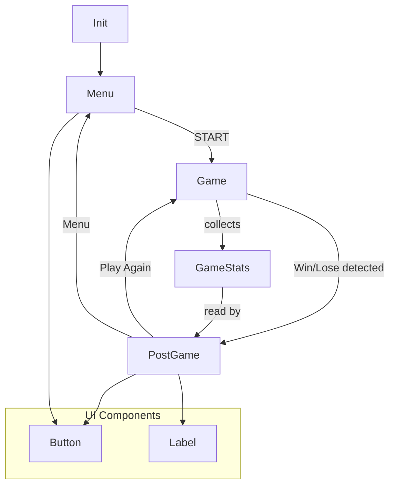
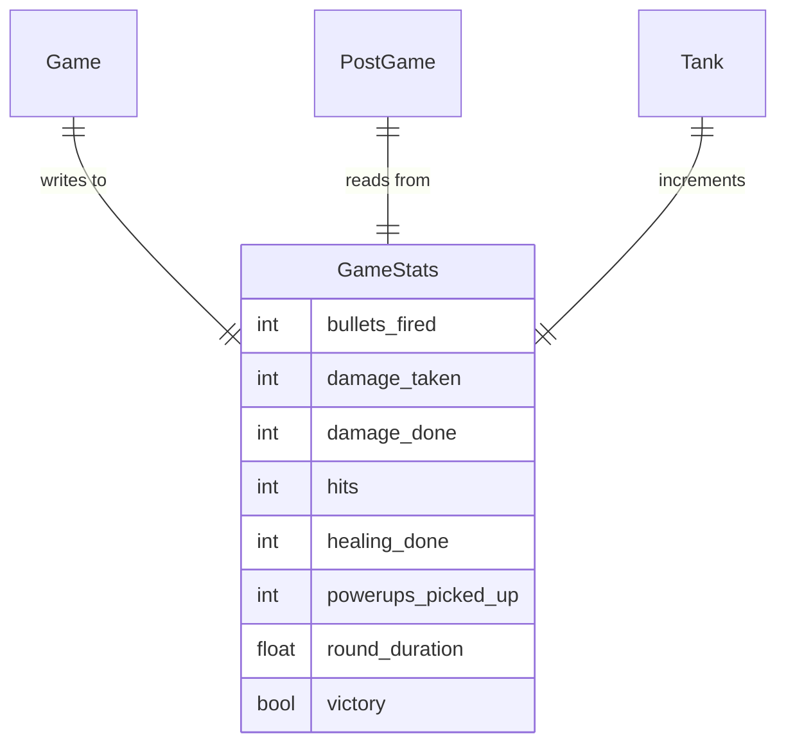
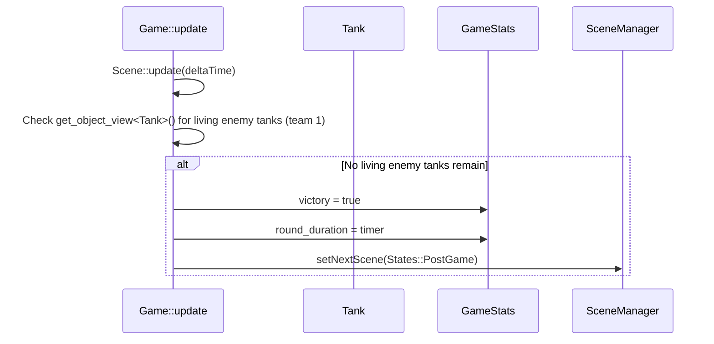
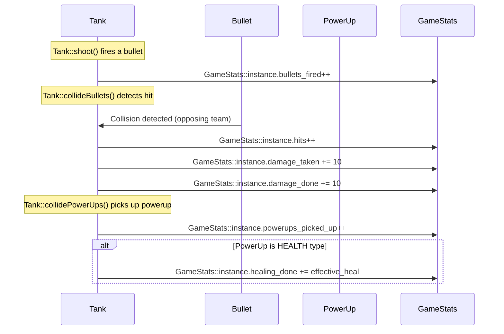
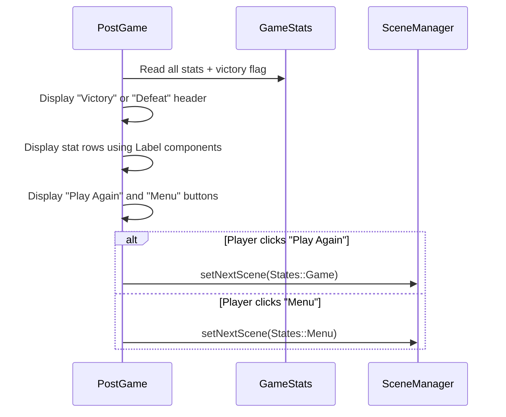

# Post-Game Stats Screen - Technical Design Document

**Status:** Draft
**Requirements Source:** [docs/requirements/post-game-stats-screen.md](../requirements/post-game-stats-screen.md)
**Created:** 2026-02-04
**Last Updated:** 2026-02-04 (rev 2)

## 1. Overview

This document describes the technical design for adding win/lose conditions and a post-game stats screen to Tanks. The implementation adds a `GameStats` struct for global stat tracking during gameplay, win/lose condition checks in the `Game` update loop, a new `PostGame` scene state, and a reusable `Label` UI component.

## 2. System Architecture

### 2.1 High-Level Architecture

### 2.2 Component Breakdown

| Component           | Responsibility                                                                           | Technology                      |
| ------------------- | ---------------------------------------------------------------------------------------- | ------------------------------- |
| `GameStats`         | Static struct holding all round stat counters; reset on round start                      | C++ struct with static instance |
| `Game` (modified)   | Detects win/lose conditions; increments stats via `GameStats`; transitions to `PostGame` | ASW Scene                       |
| `PostGame` (new)    | Reads `GameStats` and displays results; provides Play Again / Menu navigation            | ASW Scene                       |
| `Tank` (modified)   | Calls `GameStats` increment methods at stat collection points (shoot, damage, powerup)   | ASW GameObject                  |
| `Label` (new)       | Reusable UI component for rendering a text label at a position                           | ASW GameObject in `src/ui/`     |
| `Button` (existing) | Clickable UI element, already in `src/ui/`                                               | ASW GameObject                  |

## 3. Tech Stack

| Layer     | Technology          | Rationale                                                        |
| --------- | ------------------- | ---------------------------------------------------------------- |
| Language  | C++20               | Existing project standard                                        |
| Framework | ASW v0.5.11 (SDL2)  | Existing framework; provides SceneManager, GameObject, rendering |
| Build     | CMake 3.24+         | Existing build system                                            |
| Targets   | Native + Emscripten | Existing cross-compilation support                               |

## 4. Data Models

### 4.1 Entity Relationship Diagram

### 4.2 Model Definitions

#### GameStats

| Field                | Type    | Default | Description                                                   |
| -------------------- | ------- | ------- | ------------------------------------------------------------- |
| `bullets_fired`      | `int`   | `0`     | Total bullets created by all tanks (US-003)                   |
| `damage_taken`       | `int`   | `0`     | Total damage received by all tanks (US-004)                   |
| `hits`               | `int`   | `0`     | Total bullet-to-tank collisions (US-005)                      |
| `damage_done`        | `int`   | `0`     | Total damage inflicted by all bullets on tanks (US-006)       |
| `healing_done`       | `int`   | `0`     | Effective health restored by HEALTH powerups (US-007)         |
| `powerups_picked_up` | `int`   | `0`     | Total powerups collected by all tanks (US-008)                |
| `round_duration`     | `float` | `0.0f`  | Elapsed time in milliseconds from round start to end (US-010) |
| `victory`            | `bool`  | `false` | `true` if player won, `false` if player lost (US-001, US-002) |

Location: `src/game/GameStats.hpp`

## 5. API Contracts

N/A -- this is a single-player local game with no network API. All interaction is through in-memory function calls and scene transitions described in sections 2 and 6.

## 6. Sequence Diagrams

### 6.1 Win Condition Flow (US-001)

### 6.2 Lose Condition Flow (US-002)

### 6.3 Stat Collection During Gameplay (US-003 to US-008)

### 6.4 PostGame Screen Flow (US-009)

## 7. Architecture Decision Records

### ADR-001: Static GameStats struct for data passing between scenes

- **Context:** The SceneManager creates scenes fresh on each transition. Stats collected during `Game` must be accessible to `PostGame`. The codebase already uses static members for cross-scene data (e.g., `Game::map_width`, `Game::num_enemies`).
- **Decision:** Use a struct with a static instance (`GameStats::instance`) that `Game` writes to and `PostGame` reads from. A `reset()` method zeroes all fields at round start.
- **Alternatives Considered:**
  - Passing data through SceneManager template parameters -- not supported by the ASW API.
  - Global singleton class -- over-engineered for a simple data bag.
- **Consequences:** Simple, consistent with existing patterns. Stats are not thread-safe, but the game is single-threaded. The static instance persists across rounds, so `reset()` must be called in `Game::init()`.

### ADR-002: Win/lose checks in Game::update after Scene::update

- **Context:** Need to detect when all tanks of a team are destroyed. Tanks set `alive = false` during `Tank::update()`, which is called by `Scene::update()`.
- **Decision:** After `Scene::update(deltaTime)`, iterate `get_object_view<Tank>()` and count living tanks per team. If all enemies (team 1) are dead, trigger win. If all friendlies (team 0) are dead, trigger lose.
- **Alternatives Considered:**
  - Event/callback on tank death -- would require changes to the ASW framework or a custom event system. Over-engineered.
  - Checking in `Tank::update` -- the tank doesn't know if it's the last one, so the check belongs in `Game`.
- **Consequences:** Simple polling approach. The check runs every frame but is cheap (iterating a small object view). Win/lose is detected on the same frame the last tank dies.

### ADR-003: New Label UI component in src/ui/

- **Context:** The post-game screen needs to display multiple text rows (stat labels + values). The menu currently uses raw `asw::draw::text` calls. A reusable component would reduce duplication and align with US-011.
- **Decision:** Create a `Label` class in `src/ui/` extending `asw::game::GameObject`. It renders a text string at a position with a given font and color. Used for both stat labels and the victory/defeat header.
- **Alternatives Considered:**
  - Raw draw calls in PostGame::draw() -- works but doesn't create reusable components (violates US-011).
  - A complex stat-row widget with label+value columns -- over-engineered for current needs.
- **Consequences:** Lightweight, reusable. Can be adopted by Menu in the future to replace its raw draw calls if desired.

### ADR-004: Stats collection via direct calls at existing code points

- **Context:** Stats need to be incremented at specific game events (shooting, taking damage, picking up powerups). These events already happen in `Tank::shoot()`, `Tank::collideBullets()`, `Tank::collidePowerUps()`, and `Tank::pickupPowerUp()`.
- **Decision:** Add `GameStats::instance.field++` calls directly at each existing code point. No event system or observer pattern.
- **Alternatives Considered:**
  - Observer/event bus pattern -- adds architectural complexity for 6 simple counters.
  - Wrapping stats in Tank member functions -- unnecessary indirection.
- **Consequences:** Minimal code changes. Each stat increment is a single line added to an existing method. Easy to trace and maintain.

## 8. Non-Functional Considerations

### Performance

- **Stat tracking overhead:** Each stat increment is a single integer addition -- negligible cost per frame. No heap allocations.
- **Win/lose check:** One iteration of the tank object view per frame. Tank counts are typically < 20, so this is effectively O(1).
- **PostGame rendering:** Static screen with text and two buttons. Comparable to Menu performance.

### Scalability

- All stat counters use `int` (32-bit signed), supporting values up to ~2 billion. More than sufficient for any realistic round.
- `round_duration` uses `float` (matching the existing `timer` field in `Game`).

### Accessibility

- Stats displayed using the existing `ariblk.ttf` font at size 18 (slightly larger than the 12pt used in-game) for readability on the 800x600 screen.
- White text on the dark game background provides high contrast.

## 9. Risks & Mitigations

| Risk                                                          | Impact                                     | Likelihood | Mitigation                                                                       |
| ------------------------------------------------------------- | ------------------------------------------ | ---------- | -------------------------------------------------------------------------------- |
| `get_object_view<Tank>()` includes dead tanks (`alive=false`) | Win/lose check counts dead tanks as living | Medium     | Filter on `tank->alive` when counting living tanks per team.                     |
| Stats not reset between rounds when using "Play Again"        | Stats accumulate across rounds             | Medium     | Call `GameStats::instance.reset()` in `Game::init()` before any gameplay begins. |
| Scene registration for PostGame missing                       | Crash on scene transition                  | Low        | Register `PostGame` in `Init::update()` alongside `Menu` and `Game`.             |
| Sound effects for win/lose not available                      | No audio feedback                          | Low        | Reuse existing `explode` or `tank-explode` samples for win/lose audio cues.      |

## 10. Implementation Plan

### Phase 1: GameStats and stat collection (US-003 to US-008, US-010)

- [ ] Create `src/game/GameStats.hpp` with the `GameStats` struct and static instance
- [ ] Add `GameStats::instance.reset()` call in `Game::init()`
- [ ] Add `GameStats::instance.bullets_fired++` in `Tank::shoot()`
- [ ] Add `GameStats::instance.hits++`, `damage_taken += 10`, `damage_done += 10` in `Tank::collideBullets()`
- [ ] Add `GameStats::instance.powerups_picked_up++` in `Tank::collidePowerUps()`
- [ ] Add effective healing calculation and `GameStats::instance.healing_done += effective` in `Tank::pickupPowerUp()` for `HEALTH` type
- [ ] Store `timer` into `GameStats::instance.round_duration` when round ends

### Phase 2: Win/lose detection (US-001, US-002)

- [ ] Add win/lose check in `Game::update()` after `Scene::update(deltaTime)`: iterate tanks, count living (`tank->alive`) friendlies and enemies
- [ ] On win: set `GameStats::instance.victory = true`, store duration, transition to `PostGame`
- [ ] On lose: set `GameStats::instance.victory = false`, store duration, transition to `PostGame`
- [ ] Add `PostGame` to `States` enum in `State.hpp`
- [ ] Register `PostGame` scene in `Init::update()`

### Phase 3: UI components (US-011)

- [ ] Create `src/ui/Label.hpp` and `src/ui/Label.cpp` -- a `GameObject` that renders text at a position with a font and color

### Phase 4: PostGame scene (US-009)

- [ ] Create `src/state/PostGame.hpp` and `src/state/PostGame.cpp`
- [ ] `PostGame::init()`: create `Label` objects for header ("Victory"/"Defeat") and each stat row, create "Play Again" and "Menu" `Button` objects
- [ ] `PostGame::update()`: check button clicks, transition to `Game` or `Menu`
- [ ] `PostGame::draw()`: call `Scene::draw()` to render all Label and Button objects
- [ ] Add `PostGame` includes to `Init.hpp` and `main.cpp` as needed

### Phase 5: Polish

- [ ] Reuse existing sound assets (`explode`, `tank-explode`) for win and lose events
- [ ] Format `round_duration` as "Xm Ys" string in PostGame display
- [ ] Verify "Play Again" resets all state correctly (stats, map, tanks)
- [ ] Test edge cases: all enemies dead on same frame, player dies on same frame as last enemy, zero friendly AI tanks

## 11. Open Questions

- [x] ~~Does `get_object_view<Tank>()` return dead (alive=false) tanks?~~ Resolved: Yes, it does. Use `tank->alive` to filter for living tanks when checking win/lose conditions.
- [x] ~~Are new sound effect assets needed for win/lose?~~ Resolved: Reuse existing assets (`explode`, `tank-explode`).

## Changelog

| Date       | Change                                                                              | Author              |
| ---------- | ----------------------------------------------------------------------------------- | ------------------- |
| 2026-02-04 | Initial draft                                                                       | Technical Architect |
| 2026-02-04 | Resolved open questions: use tank->alive for filtering, reuse existing sound assets | Technical Architect |
